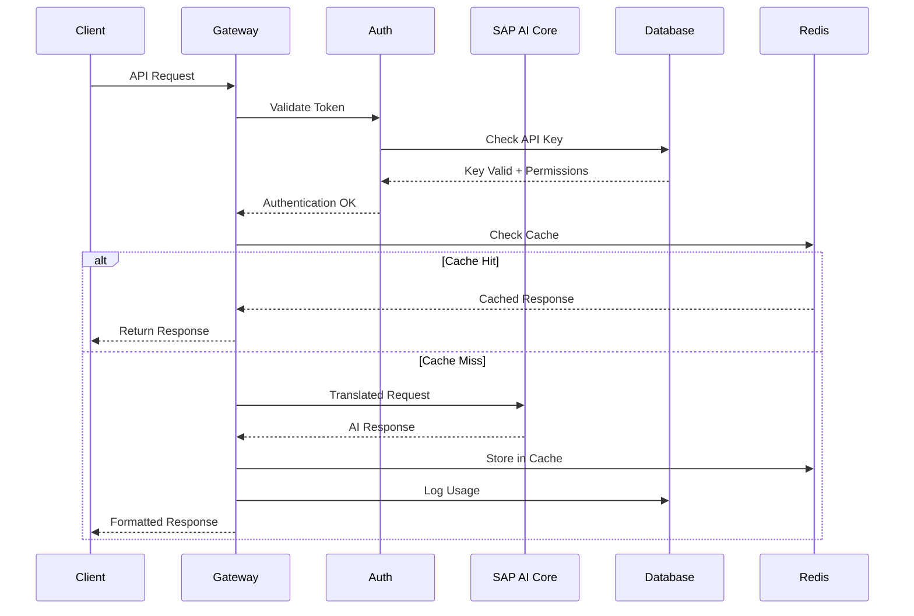

# SAIL-PROXY Developer Guide
*Multi-provider AI Gateway for SAP AI Core - Developer Documentation*
**Author:** *st-gr*

[<< Previous Chapter](chapter-1-dev-setup.md) | [Content Table](README.md) | [Next Chapter >>](chapter-3-gateway.md)

---

## Architecture Overview

### High-Level System Architecture

SAIL-PROXY implements a microservices architecture with clear separation of concerns and scalable design principles. The system acts as an intelligent proxy that translates between multiple AI API formats and SAP AI Core's unified orchestration interface.


```
┌─────────────────┐    ┌─────────────────┐    ┌─────────────────┐
│   AI Clients    │    │   SAIL-PROXY    │    │   SAP AI Core   │
│                 │    │                 │    │                 │
│ • Claude Code   │────│ • Gateway       │────│ • Orchestration │
│ • GitHub Copilot│    │ • Admin Cockpit │    │ • Models        │
│ • Custom Apps   │    │ • Ollama        │    │ • Authentication│
│ • SDKs          │    │ • Load Balancer │    │ • Governance    │
└─────────────────┘    └─────────────────┘    └─────────────────┘
```

### Core Components

#### Gateway Service (`services/gateway`)
**Purpose**: Main proxy and translation service
- **API Translation**: Converts between OpenAI, Anthropic, Bedrock, OpenRouter formats
- **Authentication**: Token validation and user authorization
- **Request Routing**: Intelligent routing to SAP AI Core endpoints
- **Response Processing**: Format translation and streaming support
- **Monitoring**: Usage tracking and performance metrics

#### Admin Service (`services/admin`)
**Purpose**: Management and administration interface
- **User Management**: Role-based access control and user provisioning
- **API Key Management**: Full lifecycle management of access credentials
- **Configuration**: Real-time system configuration and model mappings
- **Analytics**: Usage statistics, cost tracking, and reporting
- **Security**: Event monitoring and threat detection

#### Ollama Service (`services/ollama`)
**Purpose**: Ollama API compatibility layer
- **Protocol Translation**: Ollama API to OpenAI format conversion
- **Model Mapping**: Ollama model names to SAP AI Core models
- **Streaming Support**: Real-time response streaming
- **Tool Integration**: Seamless integration with Ollama ecosystem

### Data Flow Architecture

#### Request Processing Pipeline



#### Authentication Flow

1. **Token Extraction**: Parse Authorization header or x-api-key
2. **Token Validation**: Verify signature and expiration
3. **Permission Check**: Validate access to requested resource
4. **Rate Limiting**: Apply usage limits and throttling
5. **Audit Logging**: Record authentication events

#### Model Request Translation

**OpenAI to SAP AI Core**:
```typescript
// Input: OpenAI format
{
  "model": "gpt-4o",
  "messages": [{"role": "user", "content": "Hello"}],
  "stream": true
}

// Translation process
const sapModel = modelMappings["gpt-4o"]; // "gpt-4o-azure"
const orchestrationRequest = {
  orchestration_config: {
    model_name: sapModel,
    model_params: { ... },
    template_id: "chat-completion"
  },
  input_params: {
    messages: translatedMessages
  }
};

// Output: SAP AI Core format
```

### Component Communication

#### Internal Service Communication

**Service Mesh Pattern**:
- **Gateway ↔ Admin**: API key validation via shared database
- **Gateway ↔ Ollama**: Internal HTTP for model requests
- **Admin ↔ Database**: Direct PostgreSQL/SQLite connections
- **All Services ↔ Redis**: Distributed caching and pub/sub

**Communication Protocols**:
```typescript
// Internal API for service communication
interface ServiceCommunication {
  validateToken(token: string): Promise<TokenValidation>;
  getUserPermissions(userId: string): Promise<Permissions>;
  logUsage(event: UsageEvent): Promise<void>;
  publishEvent(event: SecurityEvent): Promise<void>;
}
```

#### External Integrations

**SAP AI Core Integration**:
```typescript
// OAuth2 client credentials flow
class SAPAICore {
  private async refreshToken(): Promise<string> {
    const response = await fetch(this.oauthUrl, {
      method: 'POST',
      headers: { 'Content-Type': 'application/x-www-form-urlencoded' },
      body: `grant_type=client_credentials&client_id=${this.clientId}&client_secret=${this.clientSecret}`
    });
    return response.json().access_token;
  }
}
```

**Redis/Valkey Integration**:
```typescript
// Distributed caching and pub/sub
class CacheManager {
  async get(key: string): Promise<any> {
    return await this.redis.get(key);
  }
  
  async publishUsageEvent(event: UsageEvent): Promise<void> {
    await this.redis.publish('usage-events', JSON.stringify(event));
  }
}
```

### Technology Stack

#### Backend Services

**Runtime Environment**:
- **Node.js 20+**: Native ESM support, performance improvements
- **TypeScript**: Type safety and developer experience
- **Express.js**: Web framework for Gateway service
- **SAP CAP**: Framework for Admin service

**Database Layer**:
- **PostgreSQL**: Production database for Admin service
- **SQLite**: Development and CLI deployment database
- **Valkey/Redis**: Caching, session storage, pub/sub messaging

**Authentication & Security**:
- **JWT**: Service-to-service authentication tokens
- **OAuth2**: SAP AI Core authentication
- **bcrypt**: Password hashing (if local auth enabled)
- **crypto**: AES-256 encryption for sensitive data

#### Frontend (Admin Cockpit)

**UI Framework**:
- **SAP Fiori Elements**: Enterprise UI components
- **SAP UI5**: Base UI library
- **OData V4**: API protocol for data access
- **WebComponents**: Custom UI elements

#### DevOps & Infrastructure

**Package Management**:
- **pnpm**: Workspace management and dependency resolution
- **Workspaces**: Monorepo organization with shared dependencies

**Build & Testing**:
- **Jest**: Unit and integration testing framework
- **TypeScript Compiler**: Build process and type checking
- **ESLint**: Code quality and style enforcement
- **Prettier**: Code formatting

**Containerization**:
- **Docker**: Service containerization
- **Docker Compose**: Multi-service orchestration
- **Multi-stage builds**: Optimized container images

### Configuration Management

#### Configuration Hierarchy

The system uses a cascading configuration approach:

```typescript
interface ConfigurationLayer {
  base: BaseConfig;           // Default values
  environment: EnvConfig;     // Environment-specific overrides
  service: ServiceConfig;     // Service-specific settings
  runtime: RuntimeConfig;     // Dynamic configuration updates
}
```

**Configuration Sources** (priority order):
1. **Runtime updates**: Admin Cockpit configuration changes
2. **Service configuration**: JSON files in `/config` directories
3. **Environment variables**: `.env` files and system environment
4. **Base configuration**: Default values in source code

#### Model Configuration

**Model Substitution Mapping**:
```json
{
  "model_substitutions": {
    "gpt-4o": "gpt-4o-azure",
    "gpt-4": "gpt-4-azure", 
    "claude-3-5-sonnet-20241022": "anthropic--claude-3-5-sonnet",
    "claude-3-opus-20240229": "anthropic--claude-3-opus"
  },
  "streaming_emulation": {
    "gpt-4": true,
    "claude-3-opus-20240229": false
  },
  "rate_limits": {
    "default": "1000/hour",
    "premium": "5000/hour"
  }
}
```

### Plugin Architecture

#### Plugin System Design

**Hook-based Plugin Loading**:
```typescript
interface Plugin {
  name: string;
  version: string;
  hooks: {
    beforeRequest?: (request: APIRequest) => Promise<APIRequest>;
    afterResponse?: (response: APIResponse) => Promise<APIResponse>;
    onStream?: (chunk: string) => Promise<string>;
    onError?: (error: Error) => Promise<Error>;
  };
}

class PluginManager {
  async loadPlugins(): Promise<void> {
    const pluginFiles = await glob('./plugins/*.js');
    for (const file of pluginFiles) {
      const plugin = await import(file);
      this.registerPlugin(plugin);
    }
  }
}
```

**Plugin Configuration**:
```json
{
  "plugins": {
    "mockWhimsicalGerundVerb": {
      "enabled": true,
      "config": {
        "probability": 0.1,
        "models": ["gpt-4o"]
      },
      "hooks": ["beforeRequest", "onStream"]
    }
  }
}
```

### Security Architecture

#### Multi-Layer Security Model

**Authentication Layers**:
1. **API Key Authentication**: Bearer tokens and x-api-key headers
2. **AWS SigV4**: Full signature validation for AWS Bedrock requests
3. **OAuth2 Integration**: Enterprise SSO for Admin Cockpit
4. **JWT Service Tokens**: Inter-service communication

**Authorization Model**:
```typescript
interface SecurityContext {
  user: User;
  permissions: Permission[];
  rateLimit: RateLimit;
  ipRestrictions: string[];
  auditContext: AuditContext;
}

class AuthorizationService {
  async authorize(context: SecurityContext, resource: string, action: string): Promise<boolean> {
    return this.rbac.check(context.user.role, resource, action) &&
           this.rateLimiter.checkLimit(context.user.id) &&
           this.ipFilter.validateIP(context.ipAddress);
  }
}
```

#### Cryptographic Key Management

**Key Generation and Storage** (adapted from `/CRYPTOGRAPHIC_KEY_GENERATION.md`):
```typescript
// JWT Signing Keys (256-bit)
const jwtSecret = crypto.randomBytes(32);

// Metadata Encryption (AES-256)
const metadataKey = crypto.randomBytes(32);

// AWS Secret Encryption (AES-256)
const awsSecretKey = crypto.randomBytes(32);

class CryptoManager {
  encrypt(plaintext: string, key: Buffer): string {
    const iv = crypto.randomBytes(16);
    const cipher = crypto.createCipher('aes-256-cbc', key);
    return iv.toString('hex') + cipher.update(plaintext, 'utf8', 'hex') + cipher.final('hex');
  }
}
```

### Scalability Design

#### Horizontal Scaling Patterns

**Stateless Gateway Design**:
- No session state stored in gateway instances
- All state externalized to Redis and PostgreSQL
- Load balancing friendly with consistent hashing

**Database Scaling**:
```typescript
// Read replica support for analytics queries
class DatabaseManager {
  constructor(
    private primary: PostgreSQLConnection,
    private readonly: PostgreSQLConnection[]
  ) {}
  
  async read(query: string): Promise<any> {
    const replica = this.selectReplica();
    return replica.query(query);
  }
  
  async write(query: string): Promise<any> {
    return this.primary.query(query);
  }
}
```

**Caching Strategy**:
- **L1 Cache**: In-memory LRU for hot data
- **L2 Cache**: Redis for distributed caching
- **CDN**: Static asset caching (future enhancement)

#### Performance Optimizations

**Connection Pooling**:
```typescript
// Database connection pooling
const pool = new Pool({
  connectionString: process.env.DATABASE_URL,
  max: 20,
  idleTimeoutMillis: 30000,
  connectionTimeoutMillis: 2000,
});

// HTTP agent with keep-alive
const agent = new https.Agent({
  keepAlive: true,
  maxSockets: 50,
  maxFreeSockets: 10,
  timeout: 60000,
});
```

**Response Streaming**:
```typescript
// Server-Sent Events for real-time streaming
app.post('/chat/completions', async (req, res) => {
  if (req.body.stream) {
    res.writeHead(200, {
      'Content-Type': 'text/event-stream',
      'Cache-Control': 'no-cache',
      'Connection': 'keep-alive',
    });
    
    // Stream chunks as they arrive
    sapStream.on('data', (chunk) => {
      const formatted = formatOpenAIChunk(chunk);
      res.write(`data: ${JSON.stringify(formatted)}\n\n`);
    });
  }
});
```

### Monitoring & Observability

#### Metrics Collection

**Application Metrics**:
```typescript
interface Metrics {
  requestCount: Counter;
  responseTime: Histogram;
  errorRate: Gauge;
  activeConnections: Gauge;
  tokenUsage: Counter;
}

class MetricsCollector {
  recordRequest(endpoint: string, method: string, statusCode: number, duration: number): void {
    this.metrics.requestCount.inc({ endpoint, method, status: statusCode });
    this.metrics.responseTime.observe({ endpoint }, duration);
  }
}
```

**Health Check Endpoints**:
```typescript
// Comprehensive health checks
app.get('/health', async (req, res) => {
  const health = {
    status: 'healthy',
    timestamp: new Date().toISOString(),
    services: {
      database: await checkDatabase(),
      redis: await checkRedis(),
      sapAiCore: await checkSAPAICore(),
    },
    metrics: {
      uptime: process.uptime(),
      memoryUsage: process.memoryUsage(),
      cpuUsage: process.cpuUsage(),
    }
  };
  
  res.json(health);
});
```

#### Distributed Tracing

**Request Correlation**:
```typescript
// Correlation ID middleware
app.use((req, res, next) => {
  req.correlationId = req.headers['x-correlation-id'] || 
                     crypto.randomUUID();
  res.setHeader('x-correlation-id', req.correlationId);
  next();
});

// Structured logging with correlation
logger.info('Processing request', {
  correlationId: req.correlationId,
  userId: req.user?.id,
  endpoint: req.path,
  method: req.method
});
```

### Future Architecture Considerations

#### Planned Enhancements

**Kubernetes Deployment**:
- Helm charts for simplified deployment
- Horizontal Pod Autoscaler for dynamic scaling
- Service mesh integration (Istio/Linkerd)

**Advanced Caching**:
- Prompt caching for repeated requests
- Model-specific cache policies
- Edge caching with CDN integration

**Enhanced Security**:
- mTLS for service-to-service communication
- Hardware security module (HSM) integration
- Advanced threat detection with ML

---

*Next: Dive deep into the [Gateway Service](chapter-3-gateway.md) implementation and configuration.*